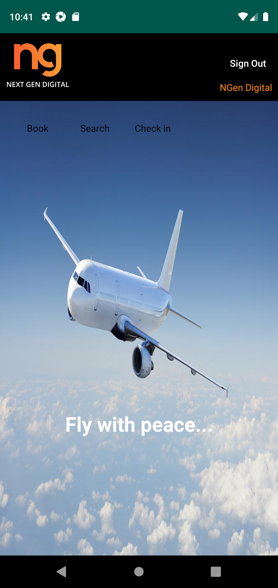
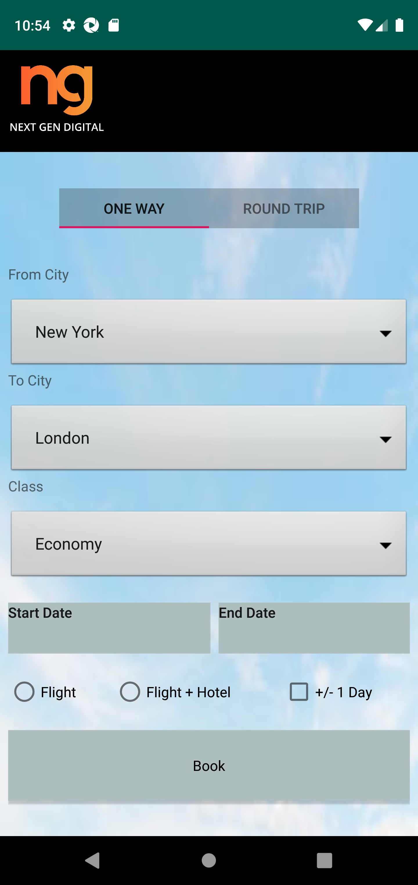
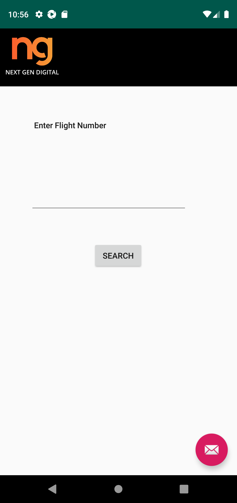

# Mobile Automation With Appium and Robot Framework - Flight Application
Repository for Learning Mobile Automation Testing

This is a mobile testing automation project built using the **Robot Framework** and **Appium**.

## Overview
The application being tested is a testing app called Flight App, designed solely for practicing mobile automation testing. It includes 3 features: Login, Booking, and Searching Booking ID.

## Features Suites Test Cases
### Suites
1. **loginSuite.robot**
   - User should be able to login with valid credentials

2. **bookSuite.robot**
   - User Should be Able to Book a Flight

3. **searchSuite.robot**
   - User Should be Able to Search by Booking ID

## Test Cases Documentation
All test cases have been created and documented in Qase.io. These test cases cover:
- Login Testing
- Book Functionality Testing
- Search Functionality Testing
The test cases have been exported to PDF for easy review and reference. You can view and download the test case PDF here: [QA-Mobile-FlightApp - Test Case]().

## Installation and Setup
To set up and run this project locally, follow these steps:

1. **Clone the repository:**
    ```bash
    git clone https://github.com/hbibakbr/QA-Mobile-FlightApp.git
    ```

2. **Navigate to the project directory:**
    ```bash
    cd QA-Mobile-FlightApp
    ```

3. **Install dependencies:**
    ```bash
    pip install -r requirements.txt
    ```

4. **Install Robot Framework and Appium Library:**
    ```bash
    pip install robotframework
    pip install robotframework-appiumlibrary
    ```

5. **Set up Android Emulator:**
    - Install [Android Studio](https://developer.android.com/studio)
    - Create and start an Android Virtual Device (AVD) from the AVD Manager in Android Studio

6. **Start the Appium server:**
    ```bash
    appium
    ```

7. **Run the tests:**
    ```bash
    robot -d results loginSuite.robot
    ```
    This will run the test cases and save output the results in the `results` directory.

## Application Screenshots
Here are some screenshots of the Flight App:

<p align="center">
    
    
    
</p>

## Acknowledgements
A huge thanks to the amazing Robot Framework and Appium communities for providing great tools for testing. Special thanks to Qase.io for their test management tools.

Happy Testing! 🚀
